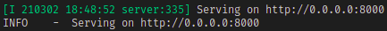

# Conecta-UnB-Wiki

## Acesse os documentos da equipe em: https://conecta-unb.github.io/Conecta-UnB-Wiki/

## Repositórios de código fonte

### [Front-end](https://github.com/Conecta-UnB/2020.2-Conecta-Unb-Frontend)

### [Back-end](https://github.com/Conecta-UnB/Conecta-Unb-Backend)

## Como testar o github pages

### Requisitos

[Docker](https://www.docker.com/)

### Intruções

Na primeira utilização, é necessário fazer o build do container, para isso, utilize o comando.
```
make build
```
Após isso basta iniciar o container com o comando.
```
make run
```
Se tudo der certo, será mostrado no seu terminal o o socket para acesso como mostrado abaixo.


###### Caso haja problemas de permissão, pode ser necessário utilizar os comando como super usuário(sudo) devido ao docker, existe também [outra solução](https://docs.docker.com/engine/security/rootless/), que consiste em utilizar o daemon do docker como um não-super-usuário.

