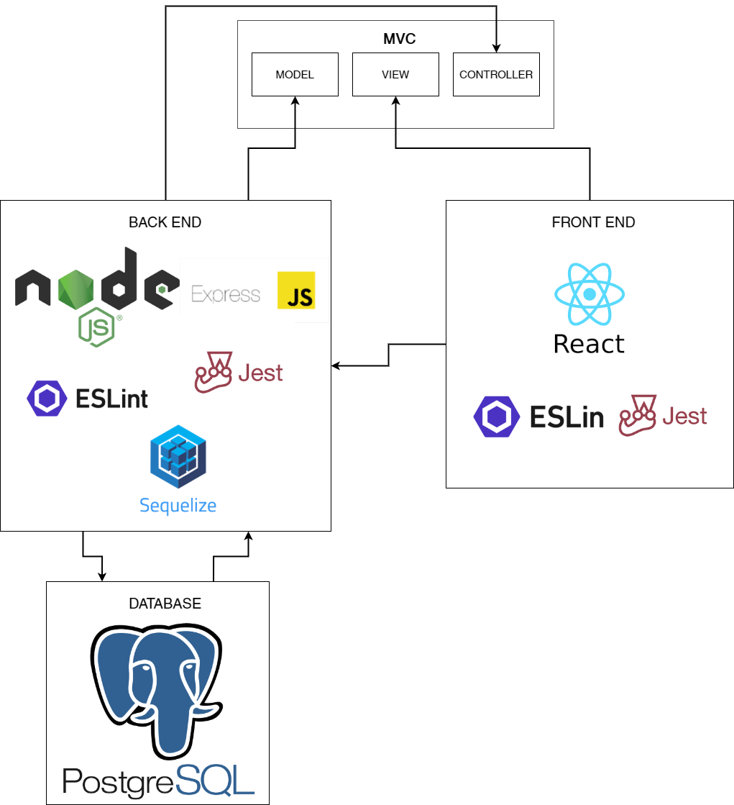

# Documento de arquitetura

## Histórico de versão

| Data | Versão | Descrição | Autor |
| ------ | ---------- | ------------- | -------- |
| 09/03/2021 | 0.1 | Criação do documento | João Lopes |
| 14/03/2021 | 0.2 | Adição da representação arquitetural |  João Lopes |

# Introdução

## Objetivos 
Este artefato tem o objetivo de fornecer uma visão geral da arquitetura da ConectaUnB. Apresenta várias visualizações de arquitetura para descrever os diferentes aspectos do sistema.

## Escopo
A ConectaUnB é uma aplicação web responsável por organizar as informações da FGA, de forma que seja acessível para todos os membros da comunidade. 

# Representação arquitetural

## Implementação
O modelo de arquitetura proposto no projeto é um modelo multicamadas, sendo composto por três camadas principais:

* **Visão:** camada em que os dados são visualizados a partir de uma interface gráfica implementada.
* **Controladora:** camada em que há o tratamento e interpretação dos eventos gerados por dispositivos de entrada.
* **Modelo:** camada que há persistência dos dados, sendo composta pelo banco de dados.

A comunicação entre as camadas é feita pelo modelo de arquitetura cliente-servidor. O servidor é responsável pela camada intermediária (Controladora), sendo responsável por lidar como a camada de persistência(Modelo), que fornece os dados para a manipulação, e com a camada de visualização (Visão), que representa por meio da interface gráfica os dados manipulados,  no qual são requisitados por meio do protocolo de comunicação ‘http’ com as outras camadas. o Cliente neste modelo realiza as requisições interagindo com a interface gráfica. 

* **Node.js:** Pode ser definido com um ambiente de execução Javascript server-side, sendo possível rodar uma aplicação standalone em uma máquina, não dependendo de um browser parar a execução.

* **React:** Biblioteca JavaScript mantida pelo Facebook com foco em criar interfaces de usuários em páginas web.
* **Express JS:** Framework para Node.js, utilizado no back-end para o gerenciamento de rotas, middleware e de outras funções, facilitando a criação de API 's. Sendo responsável por realizar a conexão entre as camadas de persistência e de controle com a camada de visão.

* **Jest:** Framework de testes criado pelo Facebook projetado para garantir a correção de código Javascript.

* **ESLint:** Ferramenta de análise de código estática para identificar padrões problemáticos encontrados em código Javascript, auxiliando no processo de refatoração do código.

* **Sequelize:** Definido como um ORM(Object-Relational Mapper) para Node.js, o sequelize tem suporte para PostgreSQL, realizando o mapeamento de dados relacionais (tabelas, colunas e linhas) para objetos Javascript.

* **PostgreSQL:** O banco de dados escolhido para o projeto, pois possui excelente integração com a Node.js. Isso permite a utilização de UUID para colunas ID do tipo primary key, além oferecer uma gama de tipos de dados, auxiliando no desenvolvimento de um bom projeto de banco de dados.

#### Back-end
Estrutura de pacotes do back-end.

#### Front-end
Estrutura de pacotes front-end.

#### Banco de dados
Modelagem da estrutura do banco de dados

## Metas e restrições arquiteturais

### Metas
Criação de uma aplicação web que tem por finalidade organizar as informações sobre a FGA, estando disponíveis para toda a comunidade. 

* **Desacoplamento:** A separação do software em duas frentes: interface de usuário (front-end) e API (back-end), facilitará para a equipe de desenvolvimento a divisão de tarefas necessárias para a construção do software. Além disso, permite escolher as melhores soluções tecnológicas para a implementação de cada frente.

* **Evolução:** A necessidade do desenvolvimento de novas funcionalidades poderá ser feita de forma independente na API e na interface de usuário, inclusive, adotando outras tecnologias, desde que a integração entre as duas frentes seja mantida.

### Restrições

* **Expertise:** A equipe possui baixa experiência de desenvolvimento com as tecnologias escolhidas. 

* **Tecnologia:** Se tratando de tecnologias emergentes, há muitas mudanças de versões que devem ser levadas em consideração na hora de adotar qualquer biblioteca.

## Visualização dos casos de uso

## Qualidade

Na API, os padrões adotados no projeto seguirão convenções do framework NodeJS, que são amplamente utilizados por projetos de diversos tamanhos.

Na interface de usuário, a utilização do React permitirá que o desenvolvimento seja realizado de forma eficiente e componentizado, com facilidade de integração com outras bibliotecas e serviços.

Os desenvolvedores do projeto também farão uso das folhas de estilo das linguagens de programação adotadas e contarão com ferramentas de análise estática, para assegurar que o desenvolvimento está de acordo com os requisitos de boas práticas de desenvolvimento de software.

## Referências

* [Documento de arquitetura da Vsign](https://fga-eps-mds.github.io/2019.2-Vsign/project/architectureDocument/)

* [Documento de arquitetura de software do Sistema de Paginação de Esportes Universitários](http://www.facom.ufu.br/~flavio/pds1/files/2016-01/Documento%20de%20Arquitetura%20de%20Software%20do%20SPEU%201-Exemplo-RUP.pdf)

